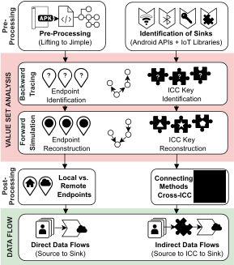

# IoTFlow - Artifact

## Overview



We use VSA to reconstruct endpoints, cryptographic data, and ICC keys for the flow analysis. We use flow analysis to find data leaks, and connect request/response data with endpoints. With the ICC information of the VSA, we support data flows involving ICC.

For more details, see [our paper "IoTFlow: Inferring IoT Device Behavior at Scale through Static Mobile Companion App Analysis"](./iotflow_paper.pdf) we presented at CCS 2023.

## Folder Structure

* [VSA](VSA/) contains the code of the value set analysis. We provided a [Docker container](VSA/docker/) to run it. Add apps to `apps_to_analyze` and hit `docker compose up` to try it out.
* [FlowAnalysis](FlowAnalysis/) contains the code of the data flow analysis. We again provided a [Docker container](FlowAnalysis/docker/apps_to_analyze/) for easier setup. Add apps to [apps_to_analyze](FlowAnalysis/docker/apps_to_analyze/) and hit `docker compose up` to try it out.
* In [config](config/) we provide the configurations we used for the analysis, e.g., the sources and sinks.
* [Datasets](datasets/) contain the app ids and version codes of the apps we used.
* In [scripts](scripts/) we added code, we used to analyze the obtained results further and generate the tables.


## How to cite:

```
@inproceedings{iotflow:ccs2023,
  title     = {{IoTFlow: Inferring IoT Device Behavior at Scale through Static Mobile Companion App Analysis}},
  author    = {Schmidt, David and Tagliaro, Carlotta and Borgolte, Kevin and Lindorfer, Martina},
  booktitle = {Proceedings of the 30th ACM SIGSAC Conference on Computer and Communications Security (CCS)},
  date      = {2023-11},
  doi       = {10.1145/3576915.3623211},
  edition   = {30},
  editor    = {Cremers, Cas and Kirda, Engin},
  location  = {Copenhagen, Denmark},
  publisher = {Association for Computing Machinery (ACM)},
}
```

## Contacts
* David Schmidt:
    * email: dschmidt@seclab.wien
    * bsky: @dschm1dt.bsky.social
    * twitter: @dschm1dt
* Carlotta Tagliaro:
    * email: carlotta@seclab.wien
    * twitter: @Pseudorandomico
* Kevin Borgolte
    * email: kevin.borgolte@rub.de
    * twitter: @caovc
* Martina Lindorfer
    * email: martina@seclab.wien
    * twitter: @lindorferin
